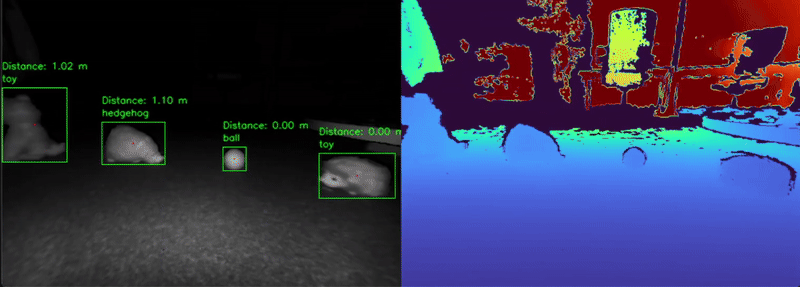

# Hybrid TOF camera Object Detection

## Overview

The Hybrid TOF Camera Object Detection project utilizes YOLOv5n for real-time object classification, leveraging the pointcloud from a TOF (Time-of-Flight) camera to acquire spatial data, including xyz coordinates and object distance. With multi-class object detection implemented in `OZT378` hybrid TOF camera, both object detection results and their distances are displayed in real time.

This project enables users to build object detection models suitable for a variety of applications, including:

- Object and animal detection for autonomous lawn mowers
- Indoor and outdoor object detection and distance measurement for vacuum robots

In this project, we use the grayscale image from the camera to do object detection with YOLOv5n, obtaining the class and bounding box. From the coordinates of the bounding box, we then can combine the pointcloud data to calculate the object's distance and diameter.

## Contents

`Data` 	- Folder containing the TOF camera images used in this project

`Models` - Folder where trained models, their predictions and generated Edge code are saved.

`Resources` - Folder where all extra resources/files can be found (including scripts for data collection and the SDK for TOF camera)

`Tools`	- Folder containing the GraphUX unit to collect data and evaluate the model in Studio (at the moment, TOF camera is not supported)

## Sensor(s) & Data

### What TOF Camera is doing

A hybrid TOF (Time-of-Flight) camera combines traditional imaging (in this case grayscale image) with a Time-of-Flight depth sensor. The TOF sensor measures the time it takes for the light to bounce back from objects, allowing it to calculate the distance (depth) to each pixel in the scene. By merging this depth information with standard image data, a hybrid TOF camera provides both 2D images and accurate 3D spatial data (xyz coordinates, pointcloud), making it valuable for applications such as object detection, gesture recognition, robotics, and augmented reality.

### Hardware needed for this project

Connect the TOF camera by USB(3.1 up) and also make sure you get the royale SDK and check the `README.pdf` file in `Resources/5.12.0.3089_royale`.

## Steps to get started: Model Labeling and Training

### Label the Data and Train a Model in Deepcraft Studio

Detailed in this file [YOLO_README.md](Resources/YOLO_README.md)

### Label the Data in Roboflow and Train a Model in Deepcraft Studio

* Upload the folder of image to Roboflow [https://roboflow.com/](https://roboflow.com/)
* Create a project and do annotation
* Download dataset as YOLO v5 PyTorch format
* From [YOLO_README.md](Resources/YOLO_README.md), Choose `Yolo` in the `Select Label Format` window when adding data, and also add `data.yaml` into `Class Map File` under `Yolo` to map the numbers to the actual name of the label 

## Model Evaluation (Graph UX live camera evaluation is not yet supported for TOF camera)

Please visit [https://developer.imagimob.com/deepcraft-studio/model-evaluation/evaluating-object-detection-model](https://developer.imagimob.com/deepcraft-studio/model-evaluation/evaluating-object-detection-model), and follow the steps under the section `Evaluating the model Predictions with Original Data`

## Adding More Data

### Data Collection via Royale Viewer

Screenshots in this file [ROYALE_VIEWER.md](Resources/ROYALE_VIEWER.md)

* Open royaleviewer
* Click `Tools`, `Data`, `Gray`
* Click `Tools`, `Single Frame Recording`
* Click `Rec` to record
* Click `Log` to see the exact place that the image(png and ply file) is saved
* Run `copy_image_from_royale` in `Resources/data_collection` folder, change `source_dir` and `target_dir` to your location to copy the image to your prefered location

### Setup for running TOF camerea with python scripts (in `Resources` folder)

For running TOF camera on python (data collection, realtime inference):

* For windows use python 3.10
* Use virtual environment (recommend)
* Install the dependencies: `pip install -r requirements.txt`
* Go to `5.12.0.3089_royale/python/packages` and run `pip install .\roypypack-5.12.0.3089-cp310-cp310-win_amd64.whl`

### Data Collection via python script for OZT378

* Connect the TOF camera by USB(3.1 up) and also make sure you get the royale SDK and check the `README.pdf` file in `5.12.0.3089_royale`
* Run `OZT378_data_collection.py` in `Resources/realtime` folder
* Data will be saved in `Resources/data_collection/OZT_378`. You can also modify `save_directory = 'your_location'` to your prefered location
* Modify `save_photo = False` as `True` if you want to save photo to the location
* Modify `sampling_rate` to adjust the frequency of saving data
* In section `adjustGrayValue` change the value to adjust the brightness of the camera. (Default 2000 in OZT378)

## Steps to Production

To bring this project and its trained models to production, follow these main steps to address key challenges and ensure robust, real-world deployment:

- **Increase Data Variability:**  
  Collect images from diverse environments, devices, lighting conditions, and use cases. Use data augmentation (rotation, scaling, flipping, cropping, brightness/contrast) to further expand dataset variety.

- **Ensure Proper Test Set Separation:**  
  Build a test set using data not present in training or validation, ideally from new scenarios, to accurately assess model generalization.

- **Add Negative Data:**  
  Include images where target objects are absent or replaced by similar non-targets or background clutter, improving robustness against false positives.

- **Real-World Testing:**  
  Test the trained model in operational settings before deployment. Monitor accuracy, latency, and reliability; use feedback to refine and improve the model.

## Demo

## Getting Started

Please visit [developer.imagimob.com](https://developer.imagimob.com), where you can read about Imagimob Studio and go through step-by-step tutorials to get you quickly started.

## Help & Support

If you need support or if you want to know how to deploy the model on to the device, please submit a ticket on the Infineon [community forum ](https://community.infineon.com/t5/Imagimob/bd-p/Imagimob/page/1) Imagimob Studio page.
## Getting Started

Please visit [developer.imagimob.com](https://developer.imagimob.com), where you can read about Imagimob Studio and go through step-by-step tutorials to get you quickly started.

## Help & Support

If you need support or if you want to know how to deploy the model on to the device, please submit a ticket on the Infineon [community forum ](https://community.infineon.com/t5/Imagimob/bd-p/Imagimob/page/1) Imagimob Studio page.