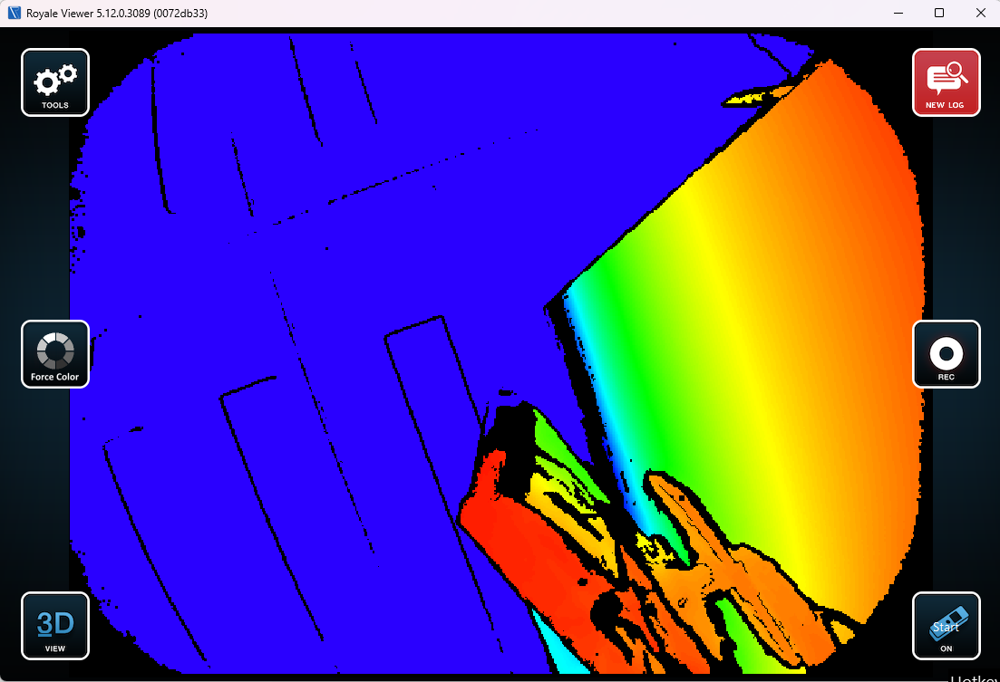
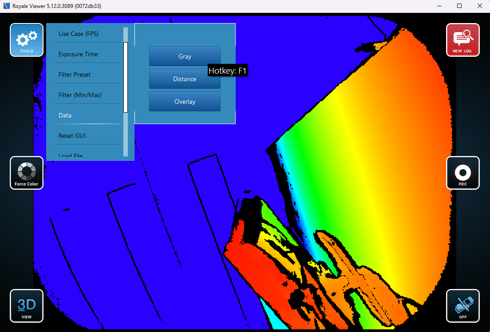
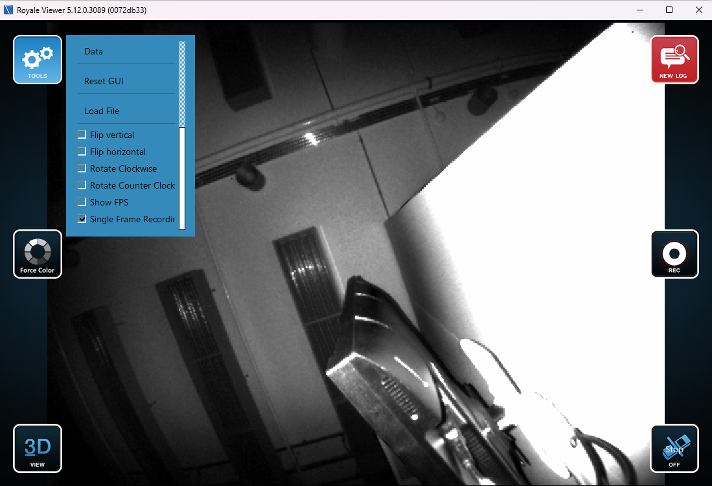
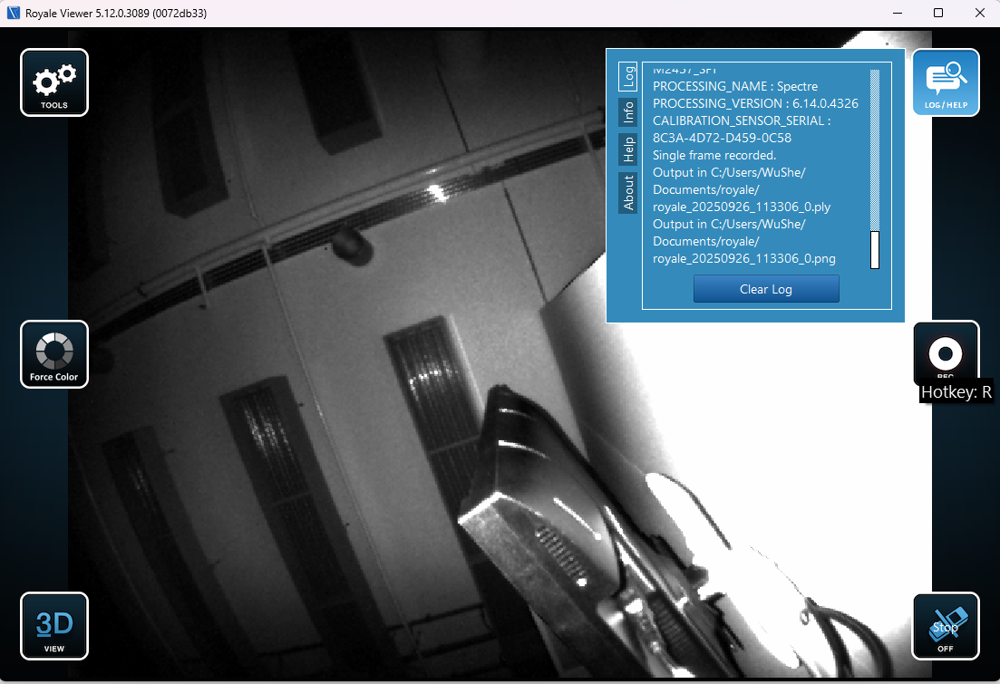

# Record Data in Royale Viewer

## Project Overview

### This document shows the steps and screenshots of recording data in royale viewer
---

### Open royaleviewer and click start

### Click `Tools`, `Data`, `Gray`

### Click `Tools`, `Single Frame Recording`

### Click `Rec` to record

### Click `Log` to see the exact place that the image (.png and .ply file) is saved

### Run `copy_image_from_royale` in `data_collection` folder, change `source_dir` and `target_dir` to your location to copy the image to your prefered location

