# Yolo Data Labeling and Training in Deepcraft

## Project Overview

This document shows the whole pipeline from project creation, data labeling, model training to model evaluation

For more details please check this link out : [https://developer.imagimob.com/](https://developer.imagimob.com/)

<!-- ## Data Collection -->

<!-- * Scrapes data from a single webpage
* Saves data to a CSV file -->

## Project Creation

* Click "New project"
* Click "Vision", "Empty Object Detection Project", set up the project name and select location

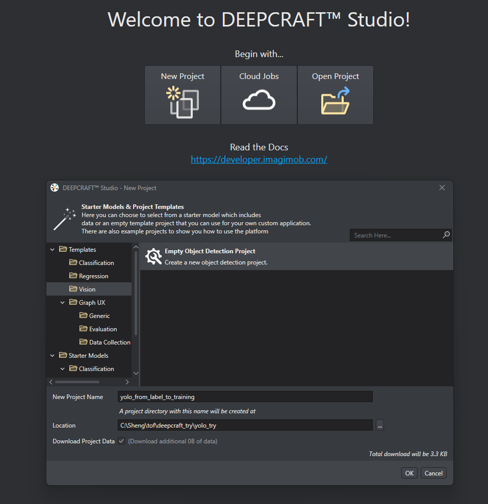

* Open the project file

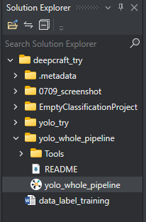

## Add Data

* In "Data" click "Add Data" in the bottom left

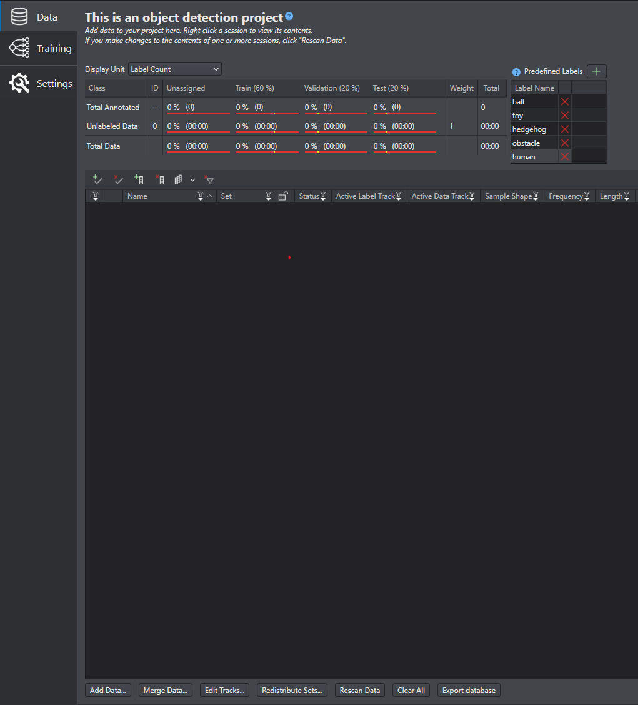

* Add Data. Drag or drop your data folder

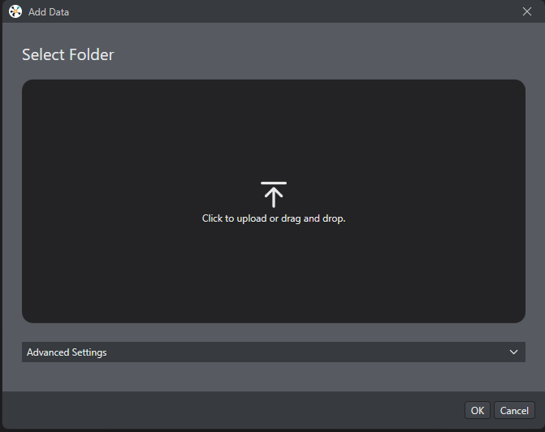

* In the Select Label Format window, in this example we are importing an image dataset without labels, so select "No Labels" checkbox

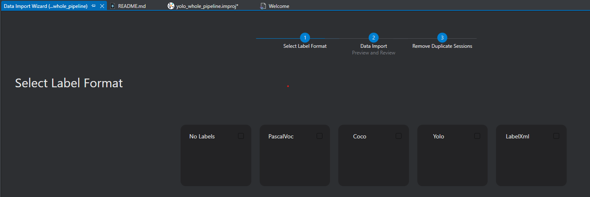

* Data Import. Click "Next"

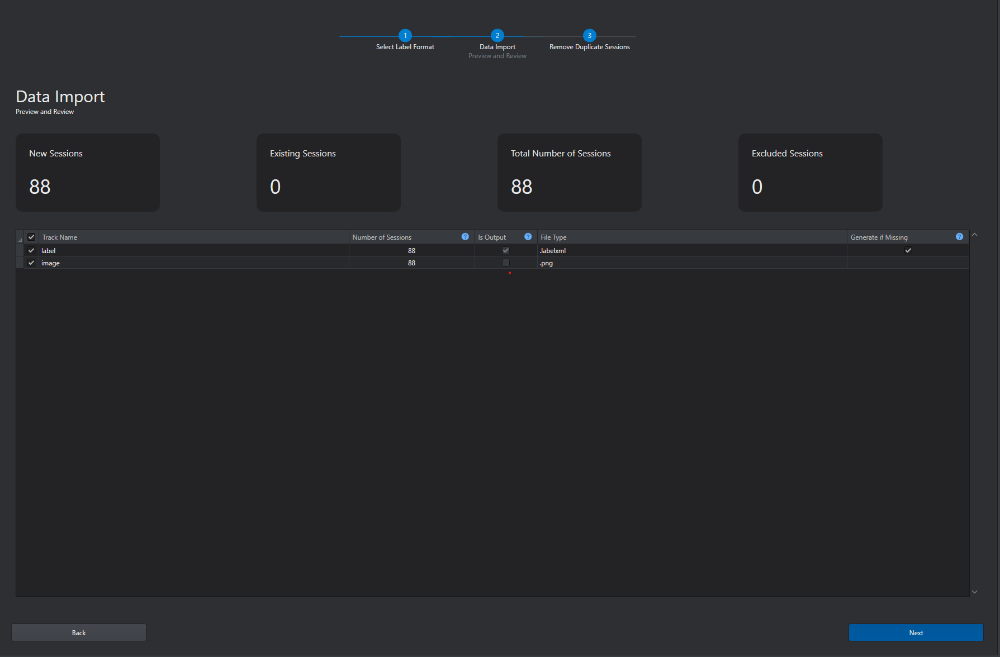

* Now we get unlabeled data

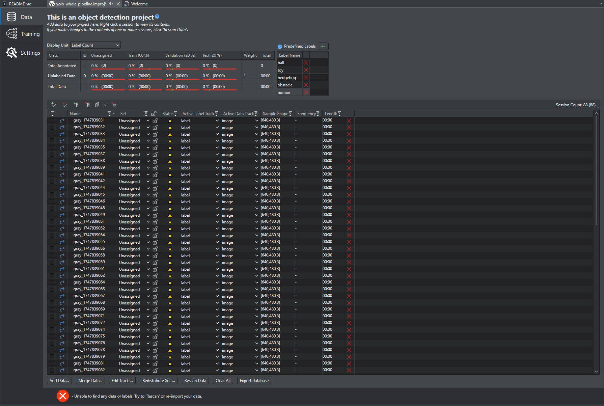

## Data Labeling

* In the Predefined Labels Setion (Top Right), click the "+" Add New label icon to add labels. Labels are created under "Label Name" column

* Double-click the session file under "Name" from the session table in which you want to add the labels. The session file window opens in a new tab. The predefined labels are displayed in the panel.

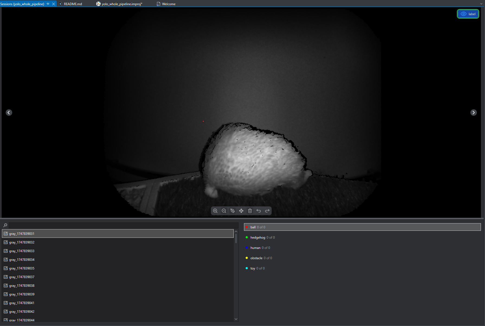

* Select a label and use Pen Tool to draw bounding box

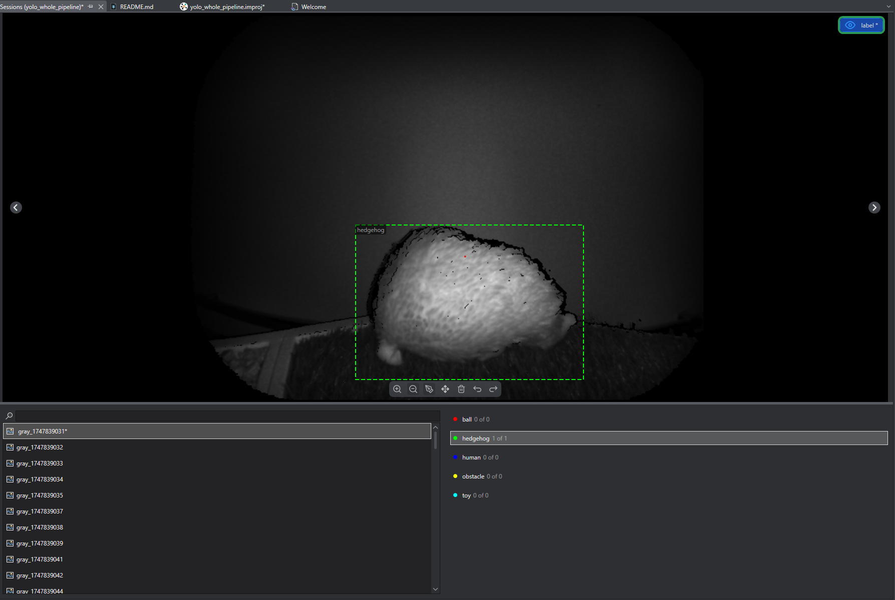

* Do it for every picture

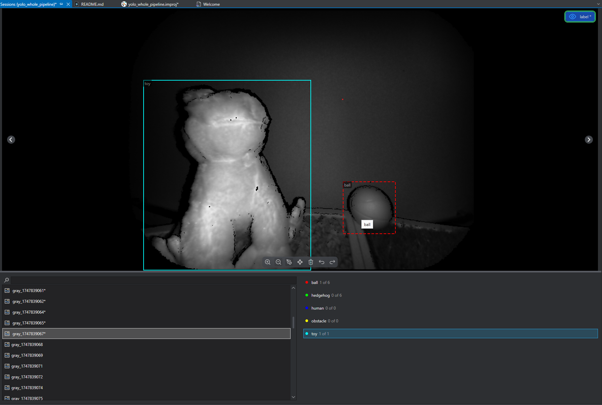

* After all data are labeled, go back to project and click "Rescan Data". Under "Status" there should be all green checks

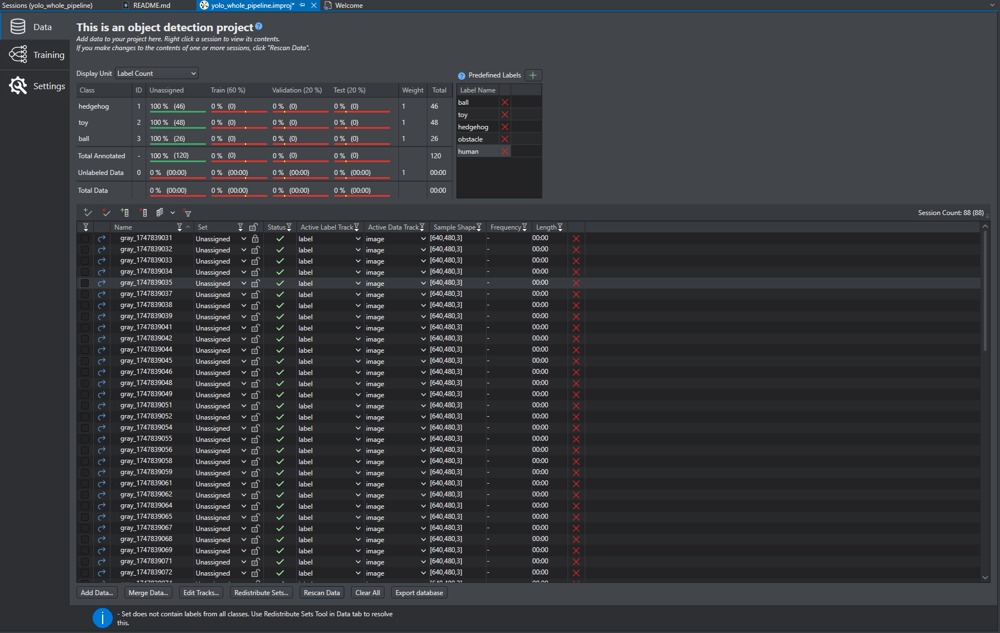

* And click "Redistribute Sets" to split the data into Training, Test and Validation Sets

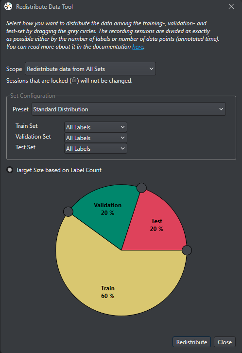

* Now data is distributed into three sets as shown under section "Set", we are ready for training

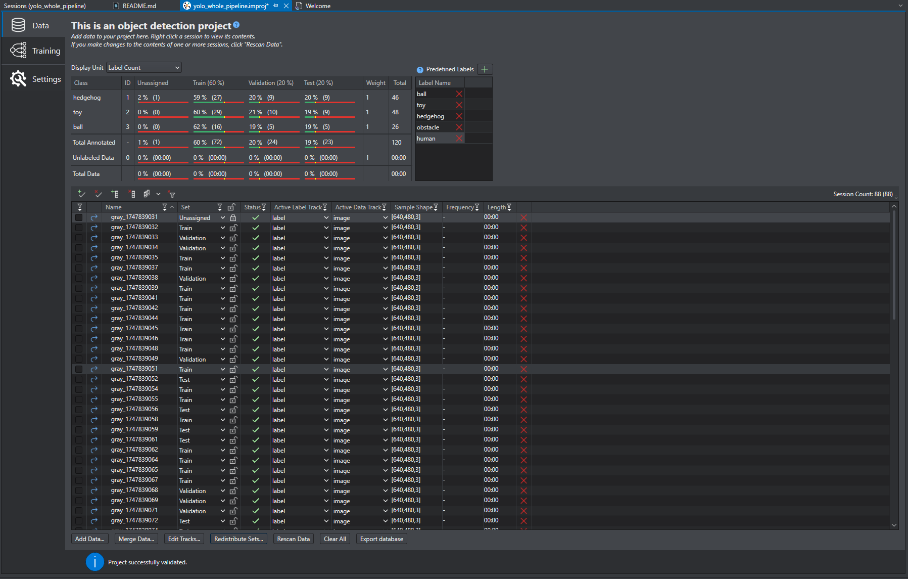

## Model Training

* Go to Training section, and set all the hyperparameters and augmentation setup. There is a default setting already

* Click "Start New Training Job" and click "OK"

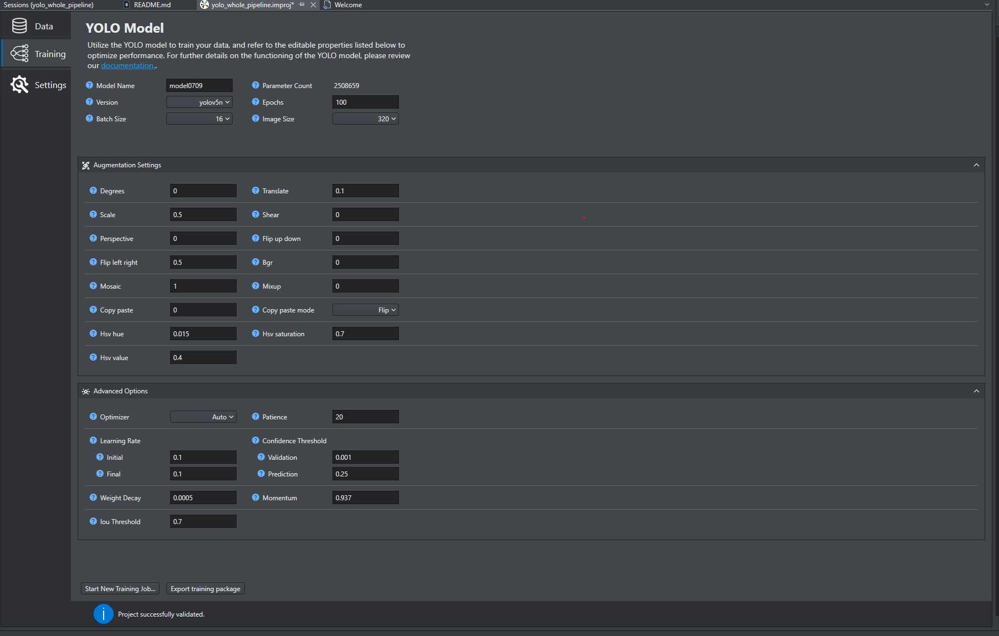

* Type the name and description and click "OK"

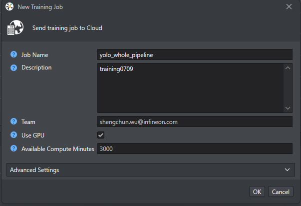

* Click "OK" to begin the training. A popup window appears indicating that the job has been started. Once again click "OK" to view the progress of the job in a new tab

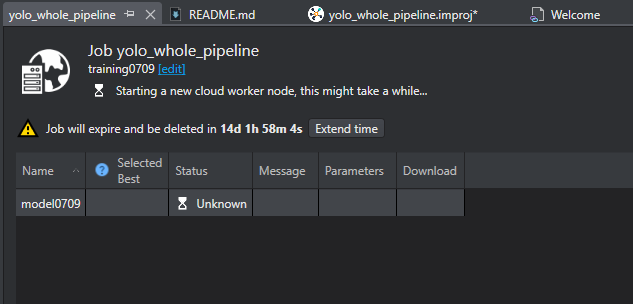

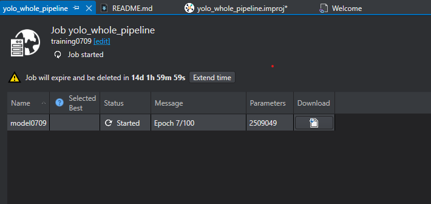

* The result will pop out after training is completed. Model can also be downloaded under the "Download" section. There you get .pt file, onnx and tflite file with various accuracy as well as performance reports

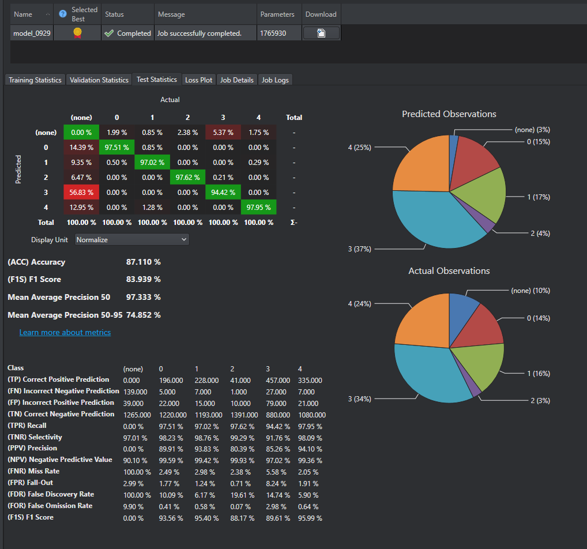

* On the top right, click the "Imagimob Cloud", "Browse Cloud Jobs", to see the current and finished jobs and their results

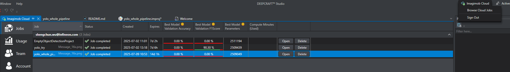

<!-- ## Model Evaluation and Download

* Scrapes data from a single webpage
* Saves data to a CSV file

## Create Project

* Scrapes data from a single webpage
* Saves data to a CSV file

## Create Project

* Scrapes data from a single webpage
* Saves data to a CSV file

<!-- ## Usage

To use this project, simply run the `scrape.py` script and follow the prompts. -->

<!-- ## Requirements

* Python 3.8+
* BeautifulSoup 4.9+

## Installation

To install this project, clone the repository and run `pip install -r requirements.txt`.

## Troubleshooting

If you encounter any issues, try checking the console output for error messages.

## Contributing

Contributions are welcome! Please submit a pull request with your changes.

## License

This project is released under the MIT License.
